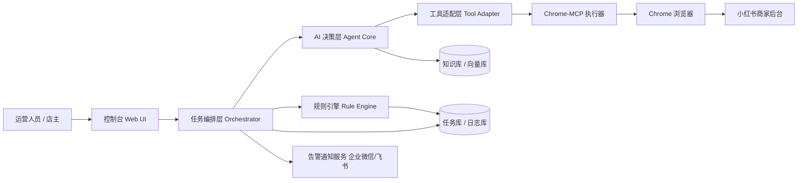

# Chrome-MCP 小红书店铺 AI 辅助机器人架构设计

## 1. 项目目标与边界

### 1.1 目标
构建一个通过 Chrome-MCP 驱动浏览器操作、可辅助管理小红书店铺的 AI 机器人，支持以下核心能力：
1. 自动化店铺巡检（商品状态、价格、库存、活动信息）。
2. 智能任务执行（上新、改价、库存更新、订单处理辅助）。
3. 运营辅助（评论/私信回复草拟、活动建议、异常预警）。
4. 人机协同（关键动作二次确认，支持人工接管）。

### 1.2 非目标（MVP阶段）
1. 不做全自动无人值守资金类操作（退款、打款等）。
2. 不绕过平台风控与安全策略。
3. 不替代最终经营决策，只提供建议与执行辅助。

---

## 2. 总体架构（分层）



### 2.1 六层说明
1. 交互层：Web 控制台 + 审批面板 + 操作回放。
2. 编排层：任务队列、状态机、重试策略、超时控制。
3. 决策层：LLM 计划器 + 子任务分解 + 结果反思。
4. 规则层：业务规则、风险拦截、操作白名单。
5. 执行层：Chrome-MCP 工具调用（点击、输入、读取、截图）。
6. 数据层：任务记录、审计日志、知识库、指标监控。

---

## 3. 核心模块设计

## 3.1 Agent Orchestrator（任务编排器）
职责：
1. 接收任务（定时任务、人工发起、告警触发）。
2. 将任务拆成标准步骤（读取页面 -> 提取数据 -> 决策 -> 执行）。
3. 跟踪状态（PENDING/RUNNING/WAIT_APPROVAL/SUCCESS/FAILED）。
4. 管理重试与降级（失败后切人工、换策略、跳过高风险动作）。

建议技术：
1. Python + FastAPI（服务层）。
2. Celery/RQ + Redis（异步队列）。
3. PostgreSQL（任务和审计存储）。

## 3.2 Agent Core（AI 决策核心）
职责：
1. 根据目标生成执行计划（Plan）。
2. 调用工具并基于页面反馈调整策略（ReAct/Tool-use）。
3. 产出结构化执行意图（JSON Action）。
4. 给出执行理由和置信度。

建议能力：
1. Prompt 模板管理（按“巡检/上新/客服”分类）。
2. 记忆机制（近期失败动作、常见页面变更规则）。
3. RAG（店铺规则、商品 SOP、话术库检索）。

## 3.3 Tool Adapter（工具适配层）
职责：
1. 将 AI 指令映射为 Chrome-MCP 原子操作。
2. 对敏感动作统一加“二次确认钩子”。
3. 做页面元素定位容错（主选择器 + 备用选择器 + 文本匹配）。
4. 把执行结果标准化回传给 Agent。

原子能力建议：
1. `open_page(url)`
2. `click(selector)`
3. `type(selector, text)`
4. `extract_table(selector)`
5. `screenshot(area)`
6. `wait_for_text(text, timeout)`

## 3.4 Rule Engine（规则与风控引擎）
职责：
1. 风险分级：低风险自动执行，高风险需审批。
2. 硬规则校验：如“改价幅度 > 20% 必须人工确认”。
3. 执行窗口控制：只在指定时段进行批量操作。
4. 速率限制：限制单位时间点击/提交次数，降低风控风险。

## 3.5 Console UI（运营控制台）
关键页面：
1. 任务中心：新建任务、查看运行状态、失败重试。
2. 审批中心：待确认动作、差异对比（前后值）。
3. 回放中心：截图时间线、操作日志、错误定位。
4. 策略中心：规则配置、SOP 模板、提示词版本。

---

## 4. 关键业务流程

## 4.1 日常巡检流程
1. 定时触发巡检任务（如每小时一次）。
2. 登录商家后台，进入商品列表。
3. 批量抓取商品状态（上架/库存/价格/违规提醒）。
4. 比对规则（库存低于阈值、价格偏离、活动冲突）。
5. 输出巡检报告并推送告警。

## 4.2 智能改价流程
1. AI 读取目标商品和当前价格。
2. 结合规则给出建议价格与原因。
3. 命中高风险规则则进入审批。
4. 审批通过后，Chrome-MCP 执行改价并截图留档。
5. 写入审计日志与结果通知。

## 4.3 客服回复辅助流程
1. 拉取评论/私信内容。
2. 结合商品知识库生成回复草稿。
3. 敏感场景（售后、投诉）强制人工确认。
4. 确认后自动填充发送，记录对话闭环。

---

## 5. 数据模型（建议）

核心表：
1. `tasks`：任务主表（类型、状态、发起人、执行结果）。
2. `task_steps`：步骤级日志（输入、输出、耗时、错误）。
3. `approvals`：审批记录（动作、前后值、审批人、时间）。
4. `shop_snapshots`：页面解析快照（商品列表、库存、价格）。
5. `knowledge_docs`：SOP/话术/规则文档。
6. `alerts`：告警事件（等级、处理状态、通知记录）。

审计原则：
1. 所有关键动作必须有截图与参数留档。
2. 所有 AI 建议需记录“模型版本 + prompt 版本 + 置信度”。

---

## 6. 稳定性与安全设计

1. 登录态隔离：独立浏览器 Profile，避免账号串用。
2. 凭据管理：密钥放入 Vault/环境变量，不写死在代码里。
3. 反脆弱执行：页面结构变化时自动降级为“只读巡检 + 人工提示”。
4. 幂等控制：每个任务有业务幂等键，防止重复执行。
5. 失败恢复：断点续跑（从失败步骤恢复，而非整任务重跑）。
6. 安全兜底：触发风控词或高危动作时强制暂停。

---

## 7. 推荐技术栈

1. 后端：Python FastAPI。
2. 任务队列：Redis + Celery。
3. AI 编排：LangGraph 或自定义状态机。
4. 浏览器执行：Chrome-MCP（DevTools 协议）。
5. 数据层：PostgreSQL + 对象存储（截图/回放）。
6. 向量检索：pgvector 或 Milvus（按规模选）。
7. 前端：Next.js + Ant Design（控制台）。
8. 监控：Prometheus + Grafana + Sentry。

---

## 8. 项目目录建议（落地骨架）

```text
xhs-ai-bot/
  apps/
    console-web/                # 运营控制台
    orchestrator-api/           # FastAPI 服务
  services/
    agent-core/                 # 任务规划与工具调用
    rule-engine/                # 业务规则与审批
    chrome-mcp-worker/          # 浏览器自动化执行器
  libs/
    prompts/                    # Prompt 模板与版本管理
    schemas/                    # Pydantic/JSON Schema
    common/                     # 日志、重试、错误码
  data/
    migrations/                 # 数据库迁移
    seed/                       # 初始规则与SOP
  docs/
    architecture.md
    sop.md
  infra/
    docker-compose.yml
    monitoring/
```

---

## 9. 实施里程碑（8周）

### 第1-2周：MVP 骨架
1. 建立任务编排服务 + Chrome-MCP 基础调用。
2. 打通登录、读取商品列表、截图留档。
3. 实现任务状态流转与基础日志。

### 第3-4周：业务闭环
1. 完成巡检任务（库存/价格异常识别）。
2. 接入告警通知（飞书/企业微信）。
3. 增加审批流（改价动作进入审批）。

### 第5-6周：AI 增强
1. 接入知识库与 RAG。
2. 增加客服回复草拟与风险分类。
3. 完成 Prompt 版本管理与A/B测试机制。

### 第7-8周：稳定性与上线
1. 补齐审计回放与错误归因。
2. 完成监控告警与容量压测。
3. 完成试运行与SOP文档，进入正式运营。

---

## 10. MVP 验收标准

1. 巡检任务成功率 >= 95%。
2. 高风险操作 100% 经过人工审批。
3. 关键动作审计覆盖率 100%（日志 + 截图）。
4. 单次巡检 200 个商品耗时 <= 10 分钟。
5. 页面结构轻微变化时可自动恢复或安全降级。

---

## 11. 下一步开发建议

1. 先实现“只读巡检 + 告警”作为第一阶段，最快产生价值且风险最低。
2. 在“改价/上下架”动作上强制审批，逐步提高自动化比例。
3. 建立每周规则复盘机制，把失败案例沉淀进规则与知识库。

